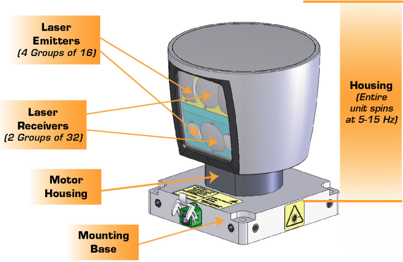

Part 1

    1. Welcome
        Prerequisites:
            C++
                Object-oriented programming (OOP)
                Memory management
            Linear algebra
                Multiply matrices and other operations on matrices
            Calculus
                Integral, derivative of polynomial functions
            Statistics
                Mean, median, standard deviation

        What are we going to learn?
            The first three courses focus on different sensor modalities, and the final course focuses on how to fuse together data from these different sensors to develop a synthesized understanding of the world.

            LiDAR
                - Process raw lidar data with filtering, segmentation, and clustering to detect other vehicles on the road. Understand how to implement Ransac with planar model fitting to segment point clouds. Also implement Euclidean clustering with a KD-Tree to cluster and distinguish vehicles and obstacles.
                - Point clouds, data representation, segment and cluster point clouds, detect objects
                Project:
                    Obstacle detection from 3D LiDAR point clouds, real point cloud data to segment into clusters in order to detect objects
                    Applying k-d trees machine learning algorithm to group points together in order to draw bounding boxes around objects.
                    Detect other cars on the road using raw lidar data from Udacity’s real self-driving car, Carla! Implement custom RANSAC and euclidean clustering algorithms.

            Camera
                - Fuse camera images together with lidar point cloud data. Extract object features from camera images in order to estimate object motion and orientation. Classify objects from camera images in order to apply a motion model. Project the camera image into three dimensions. Fuse this projection into three dimensions to fuse with lidar data.
                - Detect objects using images, fuse it with LiDAR point cloud data by projecting LiDAR point cloud data into camera image
                Project:
                    Tracking object in 3D space, fuse together data from camera and LiDARs,
                    Apply neural networks to camera images,
                    Identify where the objects are in the same environments using LiDAR point clouds
                    Fuse data together using back projection to project data from 3D LiDAR point clouds into the 2D space of a camera image
                    Detect and track objects from the benchmark KITTI dataset. Classify those objects and project them into three dimensions. Fuse those projections together with lidar data to create 3D objects to track over time.

            Radar
                - Analyze radar signatures to detect and track objects. Calculate velocity and orientation by correcting for radial velocity distortions, noise, and occlusions. Apply thresholds to identify and eliminate false positives. Filter data to track moving objects over time.
                - Physics and design of radar systems, frequency modulated continuous wave radar systems, how to apply signal processing like fast Fourier transform to the data that comes back from this system, Doppler effect how it allows inferring velocity from radar data and about CFAR - constant false alarm rate and clustering
                Project:
                    Calibrate, threshold, and filter radar data to detect obstacles in real radar data.

            Kalman Filters
                - Fuse data from multiple sources using Kalman filters. Merge data together using the prediction-update cycle of Kalman filters, which accurately track object moving along straight lines. Then build extended and unscented Kalman filters for tracking nonlinear movement.
                - Fuse together data from wide variety of sensor modalities
                - Kalman filters are probabilistic tracking tools that utilize a measurement update cycle in which we first take measurements and then update our beliefs about the world using those measurements and then repeat the cycle of measurement update Extend Kalman filters into extended Kalman filters and how to build unscented Kalman filters - extensions of vanilla Kalman filters that help account for non-linear motion data
                Project:
                    Build unscented Kalman filter highway project
                    Fuse together data from radar and LiDAR units in order to track vehicles on a highway
                    Unscented Kalman filters in order to track vehicles in non-linear motion
                    Calibrate, threshold, and filter radar data to detect obstacles in real radar data.

    2. Introduction to Sensor Fusion
    Sensor Fusion Introduction
        - Sensor fusion is part of the perception stack.
        - It involves many different sensor modalities, or types of sensors, which help a system perceive the environment around it.
        - Each sensor has its strengths and weaknesses. Here, we will learn about lidar, camera, and radar sensors, and also learn how to fuse sensor data.
        - If a camera sees an object at a distance and a radar also sees the object at a distance, it can be difficult to know if they are the same object or different objects. That is why we fuse together the sensor data to understand it better and gain a more cohesive understanding.
        - This fusion involves uncertainty. It is impossible to know exactly what the world around us looks like.

    Sensors
        Computers use many different types of sensors:
            LiDAR (Light Detection and Ranging)
            Camera
            Radar
            GNSS (Global Navigation Satellite System)
            IMU (Inertial Measurement Unit)
            Speedometer
            Odometer
            Laser range finders
            Thermal camera

    LiDAR
        - LiDAR stands for Light Detection and Ranging.
        - It is an active sensor that sends out laser beams and measures those beams as they are deflected back off of objects.
        - It has a 360-degree horizontal field of view and can measure distances up to several hundred meters by spinning around.
        - Vertical field of view varies depending on the LiDAR unit.
        - LiDAR is very good at measuring distance and creating point clouds, which are a collection of data points that represent the shape and dimensions of objects in the environment.
        - Creates point cloud: points of objects x, y, and z coordinates, and often an intensity coordinate.
        - These points can be clustered together using artificial intelligence and machine learning algorithms, and even sent through neural networks to detect objects and draw bounding boxes around obstacles in the environment.
        - However, LiDAR can be expensive and can be difficult to use in some environments, such as those with a lot of dust or fog, but the performance justifies the high cost

    Camera
        - A camera is a passive sensor that generates images from ambient light.
        - It is relatively inexpensive and can be used in a variety of environments.
        - Cameras have high resolution, which makes them good at detecting small objects and features.
        - However, cameras can be difficult to use in low-light conditions and can be fooled by shadows and glare.
        - Cameras are becoming increasingly effective at understanding night vision and generating data from the little bit of light they are able to perceive in dark environments.
        - High resolution is the main benefit of cameras, as it allows them to read signs and traffic signals that would be impossible to see with the naked eye.
        - Neural networks have become an effective tool for understanding camera images and making sense of what is in the image.
        - However, cameras have the disadvantage of not being able to accurately measure distance or speed.

    Radar

        - Radar is an active sensor that sends out radio waves and receives those waves that are reflected off of objects.
        - We can apply signal processing to those radar waveforms in order to understand the position and velocity of objects in the environment.
        - We measure position based on how long it takes for a wave to propagate out and then return back to the radar unit.
        - We measure velocity based on the Doppler effect, which is the change in frequency of a radar waveform when it bounces off an object and returns to the unit.
        - One of the challenges of radar is its low resolution. You get a signal about where the object is and how fast it is moving, but you don't get much other information about the object.
        - However, radar has several benefits. It is highly reliable and can function in many different types of environments that are challenging for other sensors.
        - It is also inexpensive and very cost-effective to put on many different types of robots, which is extremely important.

    Fusion
        - Sensor fusion is the process of combining data from multiple sensors to create a more complete and accurate understanding of the environment.
        - It is used in a variety of applications, including self-driving cars, robotics, and navigation systems.
        - There are many different methods for sensor fusion, but the most common approach is to use a Kalman filter.
        - A Kalman filter is a mathematical algorithm that uses past data to predict the future and then updates its predictions based on new sensor measurements.
        - This process helps to reduce the uncertainty in the sensor data and improve the accuracy of the overall system.

    Fusion

        - Sensor fusion is the process of combining data from different sensors to create a more comprehensive understanding of the environment.
        - It relies on the notion of uncertainty. We can never be completely certain about the state of any object in our environment.
        - However, we can use mathematical filters to fuse together data from different sensors in order to reduce our uncertainty and increase the accuracy of our estimates.
        - Most filters rely on a prediction-update cycle. In the prediction step, we make an estimate of the state of the object based on the sensor data we have so far. In the update step, we update our estimate based on new sensor measurements. We continue this cycle forever, in order to gain an increasingly accurate picture of the surrounding environment.
        - Some factors to consider when selecting a filter for sensor fusion include whether the filter operates in continuous or discrete measurement space, and how the filter handles linearity. Sensors often provide data in continuous form, but it is often easier for filters to process data in discrete form. This conversion of data from continuous measurement to discrete measurement can often introduce its own types of uncertainty and inaccuracies.
        - Linearity refers to whether an object is moving in a straight line or in a curved path. Kalman filters operate efficiently on vehicles that are moving in a straight line, but they encounter problems when vehicles begin to exhibit nonlinear curved motion. No filter is perfect, but by choosing a good filter and implementing it perfectly, we can reduce the uncertainty in sensor measurements and gain a more complete understanding of the surrounding environment.

    Kalman filters
        - Kalman filters are a type of mathematical filter that can be used to estimate the state of a system from noisy measurements. They are often used in sensor fusion applications because they can effectively deal with the uncertainty inherent in sensor data.
        - Kalman filters operate well in vehicles that are moving in a linear motion. However, they encounter problems when vehicles begin to exhibit nonlinear motion, such as curves or other difficult types of motion.
        - There are two main ways to overcome this problem:
        - Unscented Kalman filters (UKFs) are a type of Kalman filter that can be used to handle nonlinear motion. They do this by using a technique called unscented transformation, which converts the nonlinear system into a linearized system that can be handled by a Kalman filter.
        - Extended Kalman filters (EKFs) are another type of Kalman filter that can be used to handle nonlinear motion. They do this by linearizing the nonlinear system around the current state estimate.
        - Both UKFs and EKFs can be effective in handling nonlinear motion. However, UKFs are generally more accurate than EKFs, but they are also more computationally expensive.

Part 2

    1. Lidar Obstacle Detection
        Sensor fusion is taking data from multiple sensors and combining them.
        LiDAR has higher resolution than radar, but radar can directly measure velocity. By using the advantages of both these sensors, you can get a high spatial understanding of where an object is at and at the same time a good idea of how fast it is moving.
        Before doing sensor fusion, you need to understand how to process raw LiDAR data to detect where obstacles are at inside of it.

    2. Michael Maile Mercedes MBRDNA

    3. what is LiDAR
        LiDAR Stands for Light Detection and Ranging
        It sends out beams of light and measures how long it takes for the beam of light to come back. A LiDAR contains a laser. It is a contraption basically consisting of a laser, a method of deflection (basically scanning that laser beam across the field of view), and a photodiode or photo detectors that detect the incoming photons that are reflected from the object.

        How does LiDAR work?
        A laser sends out a very short pulse (a few nanoseconds) and then measures the time it takes for the pulse to go to the object and back to the lidar, where it detects it. This gives us an exact indication of the distance to the object. You scan these laser beams across the field of view, which means that you get, for each point in the field of view, a distance to an object or no distance if there is no object there whatsoever. From this, it tells you exactly what objects there are and how far away they are

    4. Lidar Sensors

        Types of LiDARs available for autonomous vehicles - developed by Velodyne:

            Rotating lidar: This type of LiDAR has a rod with a bunch of lasers on it that rotate 360 degrees and send out pulses. It rotates at about 10 Hz.
            Micro-mirror or larger mirror lidar: This type of LiDAR uses micro-mirrors or larger mirrors to scan the (one) laser beam across the field of view.
            Solid-state lidar: This type of LiDAR uses a phase array type principle, similar to phased array radars, where the phase difference between beams is used to steer the beam.
            Dispersion relationship and prism lidar: This type of LiDAR uses the dispersion relationship of light and prisms to steer the laser beam.
            Electro-optic LiDAR: This type of LiDAR uses electro-optic crystals to steer the laser beam.
            Power consumption of LiDAR:

            The power consumption of LiDAR is dependent on the type of LiDAR and the number of beams. For example, a Velodyne 64-beam lidar uses 60W in total, while a Velodyne 32-beam lidar uses 10W in total.

            Output power of LiDAR lasers:

            The output power of LiDAR lasers depends on the wavelength. 905 nm wavelength lasers use about 2mW, while 1500 nm wavelength lasers use about 10 times more power. 1500 nm lasers can reach farther than 905 nm lasers, but they are more expensive and must be eye-safe.

            Eye safety of LiDAR lasers:

            A LiDAR beam is eye-safe if you can look into it without hurting your eye. There are different wavelengths at different power levels, and different classes of lasers. Automotive LiDARs use class 1 lasers, which are eye-safe.

            Lidar

                Lidar sensing gives us high resolution data by sending out thousands of laser signals. These lasers bounce off objects, returning to the sensor where we can then determine how far away objects are by timing how long it takes for the signal to return. Also we can tell a little bit about the object that was hit by measuring the intensity of the returned signal. Each laser ray is in the infrared spectrum, and is sent out at many different angles, usually in a 360 degree range. While lidar sensors gives us very high accurate models for the world around us in 3D, they are currently very expensive, upwards of $60,000 for a standard unit.

                The Lidar sends thousands of laser rays at different angles.
                Laser gets emitted, reflected off of obstacles, and then detected using a receiver.
                Based on the time difference between the laser being emitted and received, distance is calculated.
                Laser intensity value is also received and can be used to evaluate material properties of the object the laser reflects off of.

            Lidar Sensors

                
                Velodyne lidar sensors, with HDL 64, HDL 32, VLP 16 from left to right. The larger the sensor, the higher the resolution.

            Lidar Schematic

                Here are the specs for a HDL 64 lidar. The lidar has 64 layers, where each layer is sent out at a different angle from the z axis, so different inclines. Each layer covers a 360 degree view and has an angular resolution of 0.08 degrees. On average the lidar scans ten times a second. The lidar can pick out objects up to 120M for cars and foliage, and can sense pavement up to 50M.

                
                VLP 64 schematic, showing lidar emitters, receivers, and housing.

            Lidar Schematic

                
                VLP Sensor Specifications

            How many Lidar Points?
                Approximately how many points does an HDL 64 collect every second given these specs? Assume an average update rate of 10Hz.
                    256,000
                    2,880,000
                    2,560
                    5,120,000

    5. What is a point cloud?

        A point cloud is a set of all LiDAR reflections that are measured. Each point is created when a laser beam hits an object and is reflected back to the LiDAR unit. Laser beams are very narrow in diameter, so each point in the point cloud represents a very small area of the object.

        How much data does a LiDAR unit generate?

        The amount of data generated by a LiDAR unit depends on the principles of the LiDAR, the field of view, and the layers of the beams. A typical LiDAR unit can generate around 100MB of data per second roughly. A 64-beam LiDAR unit will generate more data than a 2-beam or 10-beam LiDAR unit.

    6. Point Cloud data - .pcd file
        (x,y,z,i),
        (x,y,z,i),
        (x,y,z,i),
        .
        .
        .

        i - signal strength,tells us about the reflective properties of the material
        256000 points for every update

        

        - Same as car's local coordinates
        x axis points front of car
        y axis points to left
        z axis points straight up vertical
        - the range for each layer is 26.8 degree.
        - Each of the 64 layers will be evenly spread across the 26.8 degree range
        - 
    7. What tools does Mercedes use to work with point clouds?
        - Stereo Cameras - mercedes proprietery
        - point cloud library - deals with segmentation, seperation of ground plane,
        segmentation of point cloud to get the images or object out of point cloud, known as clustering segmentation
        - OpenCV
    8. PCL library - https://pointclouds.org/
        - C++
        - The PCL library is an open source tool for PCD. It is widely used as many tutorials and has built-in functions for filtering, segmentation, and clustering. It is also useful for rendering for point clouds and shapes.
